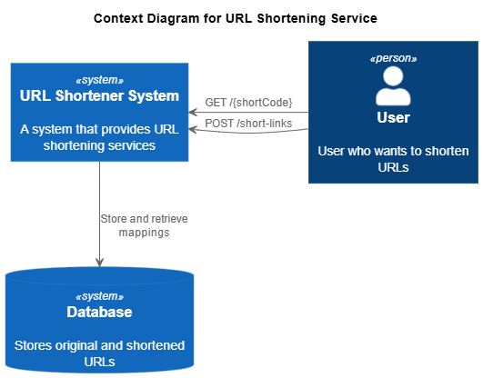
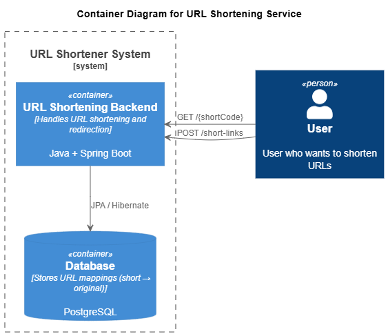
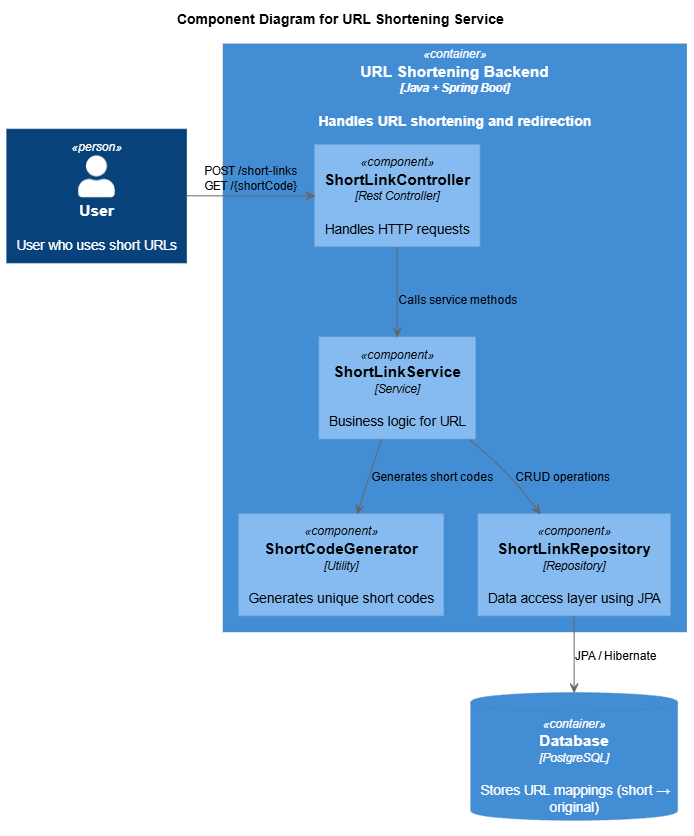
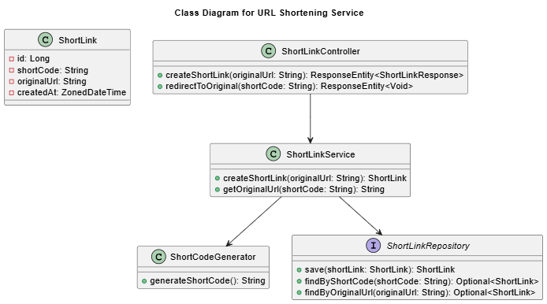

# C4 Architecture - ShortLink

## 1. Context (C1)

**Описание:**

- Пользователь отправляет запросы к сервису сокращения ссылок
- Сервис хранит данные в базе данных PostgreSQL
- Основные взаимодействия: POST /short-links, GET /{shortCode}

---

## 2. Containers (C2)

**Описание:**

- `URL Shortening Backend` - Spring Boot приложение, обрабатывающее HTTP запросы
- `Database` - PostgreSQL, хранит URL маппинги
- Взаимодействие осуществляется через JPA/Hibernate

---

## 3. Components (C3)

**Описание:**

- `ShortLinkController` принимает входящие HTTP запросы
- `ShortLinkService` реализует бизнес-логику
- `ShortCodeGenerator` создаёт короткие коды
- `ShortLinkRepository` взаимодействует с БД

---

## 4. Classes (UML)

**Описание:**

- `ShortLink` - сущность, представляющая оригинальный URL и короткий код.
- `ShortLinkController` - REST-контроллер, принимающий HTTP-запросы.
- `ShortLinkService` - бизнес-логика (создание и разрешение ссылок).
- `ShortCodeGenerator` - компонент для генерации коротких кодов.
- `ShortLinkRepository` - слой доступа к базе данных через Spring Data JPA.

## Key Relationships

- Controller → Service
- Service → Repository
- Service → Generator
- Repository → Entity
